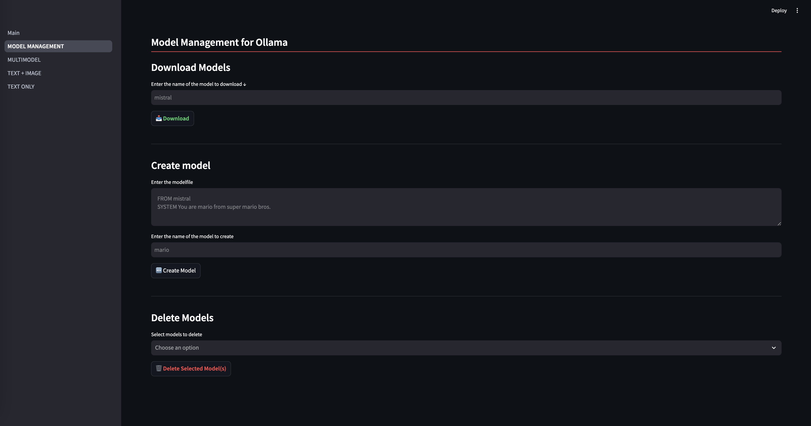
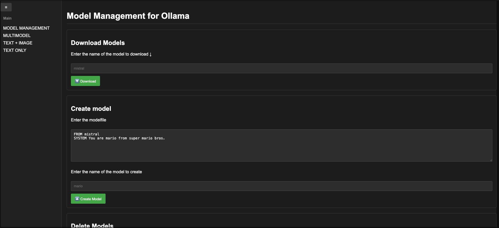
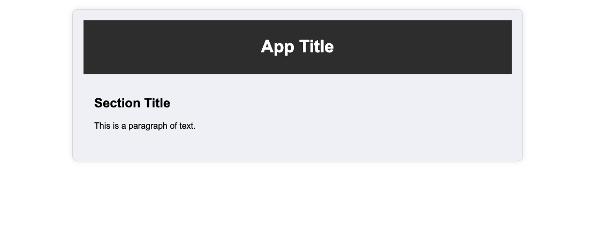
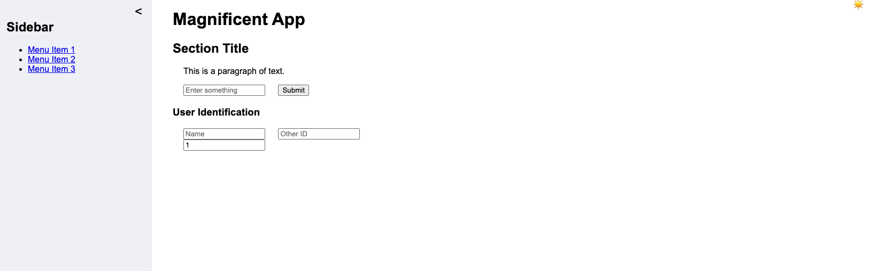

# GENERATING HTML to Resemble an Streamlit App

Used claude, gemini, and meta.ai for this purpose.

## Claude: 

- With claude I provided an image and ask: 

    Please provide HTML code to recreate the attached image. Make sure the panel to the left is dynamic, acting like a sidebar. Additionally add footnote.

    This is the original image: 

    and this is the output: 

- I was also able to ask for a few corrections, but the free program is limited. 

## Meta

- Initial question: Can you provide html code to generate a page similar to a regular streamlit app? 

    This is the initial output 

After this, I started giving other instructions and ended up with a "better" depiction of the task. 

- Additional instructions incuded: 

    Can you include a sidebar?

    Can you add button to make the sidebar appear and disappear.

    Can you add a button to switch between light (as it is right now) and dark mode?. Place this button in the lower left corner of the slidebar.

    Most of the above were responded as a single file with css style and javascript together with HTML. 

- Once a limit in the size of the response was reached, I aske to princt each, HTML, js and css in separate responses. 

- Then I asked for more dynamic changes like: 

    Can you add a container named "user identification", to the main section with two inputs, one call "name" and the 
    "other id". This container needs to be dynamic, so that the user can add additional user identifications when needed

    Add another button with a number input. Minumum number 1 and on change, duplicate the container above.

Still a WIP, but it was nice to be able to interact with the LLM and improve the design. 

## Gemini

- Same question as Meta, but the reponse was a general code with no specific format. 

This functionality is in TALK_TO_LLAMA_STRAMLIT
