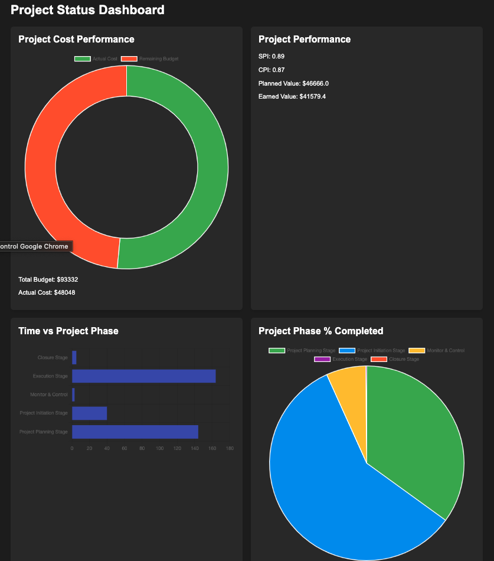
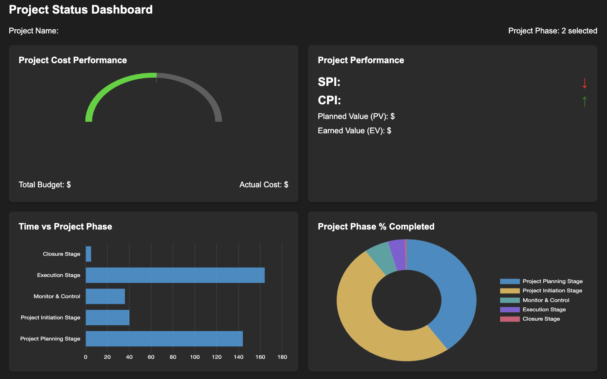
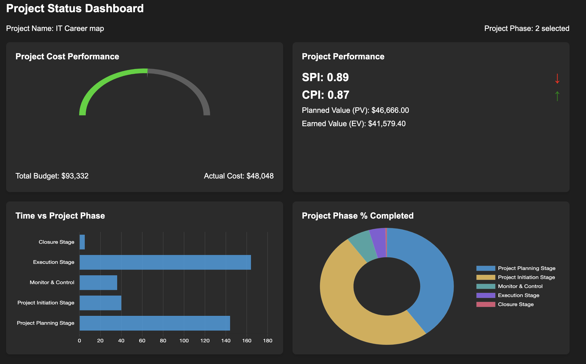

# Using Claude to generate a dashboard from an screenshot

With this test I wanted to check if Claude can create a full dashboard application from an screenshot. 

Idea taken from : https://www.youtube.com/watch?v=kyMuevbx5VQ

Steps: 
1. Search in google "Example of a Dashboard". 

2. Take an screenshot of any example 

3. Visit www.claude.ai (Needs an account - Free account is limited to few questions) 

4. Upload the screenshot and tell the model to: "Turn this into a flask app"

5. Use the results of the model to create the app. The app is in the folder claude_flask

<h2 style = "text-align:center; color:green"> It worked on the first run. </h2> 

6. Repeat with other libraries: 
    
    6.1 FLASK

    6.2. STREAMLIT: 

    6.3. DJANGO (python manage.py runserver): 
    
    More complicated and did not result that great. 

    Had to go back and ask to create and populate some of the files. 

    6.4. Fast API (python run.py): 
    
    More complicated and did not result that great. 

